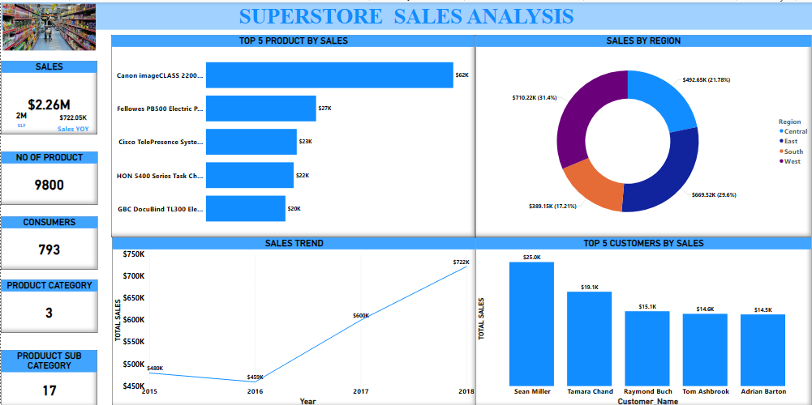
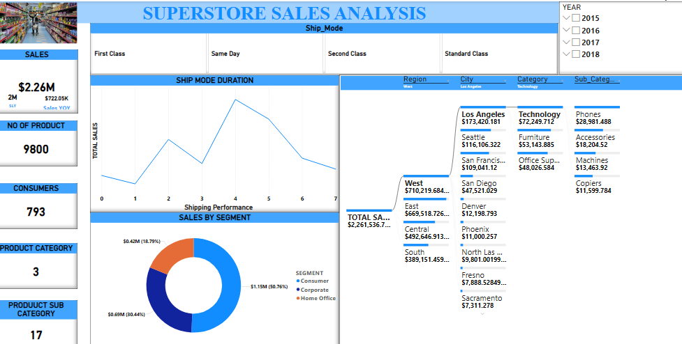

## ***SUPERSTORE-SALE-ANALYSIS***📊

## Introduction
This dataset was sourced during a 1-month data analysis internship with **Alfidotech**, where I had the opportunity to deepen my analytical skills. Working on this dataset was an engaging experience, as it allowed me to apply and refine my data analysis techniques effectively.

## Problem Statement
🔍 **Analyze sales data** to identify trends, patterns, and areas for improvement in sales performance by:
- Region 🌍
- Product 📦
- Category 🏷️
- Subcategories 🛒

## Skills Demonstrated
- **Data Cleaning and Preparation**: Formatting data for accurate analysis 🧹
- **Data Exploration**: Conducting descriptive statistics to understand patterns and trends 📈
- **Data Visualization**: Creating charts and dashboards to communicate findings 📊
- **Critical Thinking & Research**: Analyzing data and identifying insights 🤔
- **Technical Proficiency using DAX functions**: Creating custom measures for advanced insights 🔧
- **Problem Solving Skills**: Drawing actionable insights from data 🧩

## Data Sourcing
The data was sourced through a shared link, leading to a Kaggle dataset, which was downloaded as an Excel file. The dataset was then transformed using Power Query and loaded into **Power BI** for further analysis.

## Dataset Overview:
- **Total Records**: 9,800
- **Details**: Orders, customers, products, and regional sales across the United States
- **Objective**: Comprehensive view of the store’s operations and performance metrics

## Data Transformation 🔄
Data was cleaned and transformed using the **Power Query Editor** in Power BI:
- Promoted headers and changed the data type for specific columns (e.g., order date, ship date, sales to decimal, row_ID to text)
- Used **DAX Functions** for calculated measures:
  - **Shipping Performance**: `Shipped Date - Order Date` to calculate shipping duration 📦✈️
  - **Total Consumers**: `DISTINCTCOUNT(customer_name)` 👥
  - **Sales Last Year**: `CALCULATE(TOTAL SALES, SAMEPERIODLASTYEAR(date))`
  - **Current Year Sales**: `CALCULATE(TOTAL SALES, DATESYTD(date))`
  - **Sales Year Over Year**: `(Current Year Sales - Sales Last Year) / Sales Last Year`
  - Created a **Calendar Date** for tracking sales trends 📅

## Data Analysis and Visualization 📊

### Insights and Recommendations

1. **Regional Analysis** 🌎
   - The **West** region recorded the highest sales at **$710,219.68**, driven by high demand for technology products (especially phones in Los Angeles).
   - The **South** had the lowest sales at just **$2,064**, due to limited demand for office supplies and art products in areas like Jupiter.

   **Recommendation**: Focus on expanding technology products in the **West** region to maintain high sales performance.

2. **Shipping Performance** 🚚
   - **4-day deliveries** generated the highest sales of **$621,539**, with 2,718 products sold to 649 customers.
   - **1-day deliveries** had the lowest sales of **$66,700**, likely due to higher shipping costs.

   **Recommendation**: Promote **budget-friendly shipping options** (like Standard Class) to maintain sales while exploring ways to reduce the cost of expedited shipping for customers valuing speed.

3. **Sales Trends (2015–2018)** 📅
   - Sales saw a **significant improvement** from 2017 to 2018, with a **40% increase** in products sold and an **8.7% increase** in consumers.
   - From **$600.19K** in 2017, sales rose to **$722.05K** in 2018.

   **Early Struggles**:
   - Limited **product variety**.
   - Insufficient **outreach** to drive sales.
   - Delays in **product availability** and **delivery performance**.

4. **Top/Least Performing Products and Customers** 🏅
   - The top-performing customer, **Sesan Miller**, and the best-selling product, **Canon ImageCLASS 2200 Advanced**, were major contributors to revenue.
   - Products like **Eureka Disposable Bags** need reassessment due to poor performance (only **$1.625** in sales).

   **Recommendation**: Invest in top-performing products (e.g., Canon ImageCLASS) and **phase out or re-strategize** low-performing items like **Eureka Disposable Bags**.

---

## Tools & Technologies
- **Power BI** for data transformation and visualization 🖥️
- **Power Query Editor** for data cleaning 🧹
- **DAX Functions** for custom measures and advanced calculations 🔧

---

## Conclusion
This analysis provided a comprehensive overview of the sales performance of a superstore in the United States. By focusing on regions, shipping performance, and product sales trends, actionable insights were derived to improve overall performance. Future strategies should emphasize expanding high-demand products in key regions and optimizing shipping methods.
